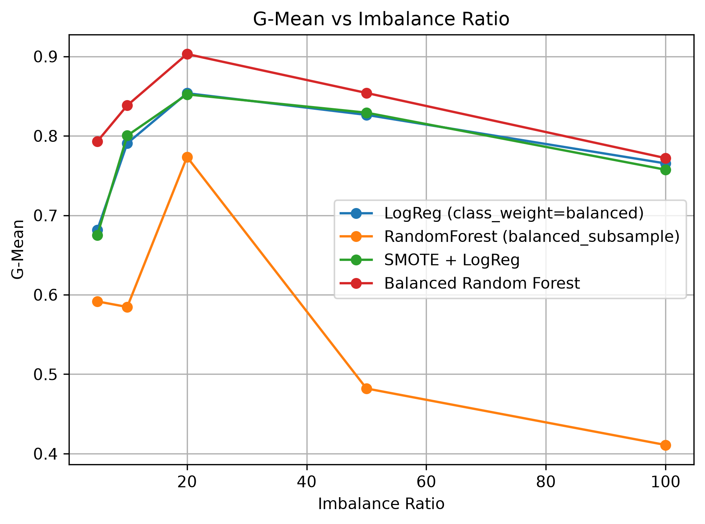
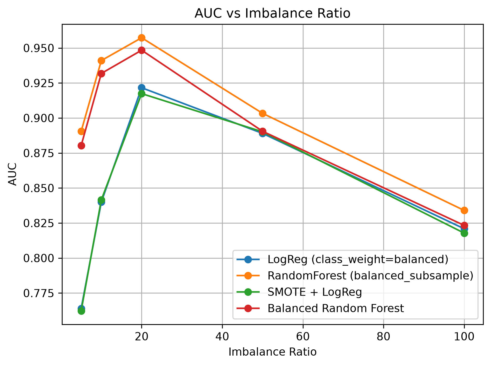

# Imbalanced Classification Benchmark

A machine learning experiment comparing different classification strategies under increasing levels of class imbalance.

## Overview

Class imbalance is a common problem in machine learning where one class contains significantly fewer samples than another. This can cause a model to perform well overall while performing poorly on the minority class.

This project investigates how different machine learning approaches behave as class imbalance becomes increasingly severe.

Synthetic binary classification datasets were generated using multiple imbalance ratios:

* 5:1
* 10:1
* 20:1
* 50:1
* 100:1

Four different classification strategies were evaluated at each imbalance level.

## Machine Learning Models

The following approaches were compared:

### Logistic Regression with Class Weighting

Logistic Regression was trained using balanced class weights to give more importance to the minority class.

### Random Forest with Balanced Subsampling

Random Forest was trained using `balanced_subsample` to adjust class weights during the construction of individual trees.

### SMOTE + Logistic Regression

SMOTE (Synthetic Minority Over-sampling Technique) was applied to generate additional minority-class samples before training Logistic Regression.

### Balanced Random Forest

Balanced Random Forest was used as an ensemble method specifically designed for imbalanced classification problems.

## Experimental Setup

The experiment was repeated across increasing class imbalance ratios:

```text
5:1 → 10:1 → 20:1 → 50:1 → 100:1
```

For each ratio, the same classification approaches were trained and evaluated so that their performance could be compared as the minority class became progressively smaller.

Stratified splitting was used to preserve the class distribution between the training and testing datasets.

## Evaluation Metrics

Three evaluation metrics were used.

### Cohen's Kappa

Cohen's Kappa measures agreement between predicted and actual classes while accounting for agreement that could occur by chance.

### G-Mean

G-Mean measures the balance between performance on the majority and minority classes.

This is particularly useful for imbalanced classification because a model must perform reasonably well on both classes to achieve a high G-Mean.

### AUC

Area Under the ROC Curve (AUC) measures the model's ability to distinguish between the two classes across different classification thresholds.

Using multiple metrics provides a more meaningful evaluation than relying only on accuracy for an imbalanced dataset.

## Results

The experiment shows that model behaviour changes considerably as class imbalance becomes more severe.

Balanced Random Forest produced strong G-Mean performance across the tested imbalance ratios, demonstrating the benefit of using techniques specifically designed for imbalanced classification.

The results also demonstrate why AUC should not be considered alone. A model can maintain a relatively strong AUC while its ability to correctly handle both classes, represented by G-Mean, becomes weaker.

## G-Mean Comparison

The following graph compares G-Mean performance as the imbalance ratio increases.



The comparison shows how effectively each approach maintains balanced classification performance as the minority class becomes increasingly rare.

## AUC Comparison

The following graph compares AUC across the different imbalance ratios.



This provides another view of how well each model separates the two classes as the classification problem becomes increasingly imbalanced.

## Example Results

Some of the experimental results include:

| Imbalance Ratio | Model                              |      Kappa |     G-Mean |        AUC |
| --------------: | ---------------------------------- | ---------: | ---------: | ---------: |
|             5:1 | Logistic Regression (Balanced)     |     0.2470 |     0.6817 |     0.7639 |
|             5:1 | Random Forest (Balanced Subsample) |     0.4412 |     0.5916 |     0.8905 |
|             5:1 | SMOTE + Logistic Regression        |     0.2363 |     0.6751 |     0.7623 |
|             5:1 | **Balanced Random Forest**         | **0.5365** | **0.7930** |     0.8803 |
|            10:1 | Logistic Regression (Balanced)     |     0.4142 |     0.7906 |     0.8400 |
|            10:1 | Random Forest (Balanced Subsample) |     0.4820 |     0.5846 | **0.9410** |
|            10:1 | SMOTE + Logistic Regression        |     0.4453 |     0.8003 |     0.8415 |
|            10:1 | **Balanced Random Forest**         | **0.6992** | **0.8383** |     0.9318 |
|            20:1 | Logistic Regression (Balanced)     |     0.3624 |     0.8537 |     0.9216 |
|            20:1 | Random Forest (Balanced Subsample) | **0.7299** |     0.7734 | **0.9573** |
|            20:1 | SMOTE + Logistic Regression        |     0.3794 |     0.8522 |     0.9174 |
|            20:1 | Balanced Random Forest             |     0.6899 | **0.9030** |     0.9484 |

## Key Findings

The experiment demonstrates several important characteristics of imbalanced machine learning:

* Model performance can change significantly as class imbalance increases.
* Accuracy alone would not provide enough information about model quality in this type of problem.
* Class weighting and resampling can help models account for minority-class samples.
* SMOTE provides an alternative approach by creating synthetic minority-class examples.
* Balanced ensemble methods can provide strong performance when dealing with severe class imbalance.
* Different evaluation metrics can give different views of model performance.

## Technologies

* Python
* NumPy
* pandas
* scikit-learn
* imbalanced-learn
* Matplotlib
* Jupyter Notebook

## Project Structure

```text
imbalanced-classification-benchmark/
│
├── imbalanced_classification.py
├── README.md
├── requirements.txt
├── .gitignore
│
└── results/
    ├── gmean_vs_imbalance.png
    └── auc_vs_imbalance.png
```

## Running the Project

Install the required Python packages:

```bash
pip install -r requirements.txt
```

Then run the experiment:

```bash
python imbalanced_classification.py
```

The script generates synthetic datasets at different imbalance ratios, trains the classification models, evaluates their performance, and compares the results.

## Future Improvements

Possible extensions to this experiment include:

* Testing additional oversampling and undersampling techniques.
* Comparing additional ensemble classifiers.
* Performing hyperparameter optimization.
* Evaluating precision-recall curves.
* Repeating experiments across multiple random seeds.
* Applying the same approaches to real-world imbalanced datasets.

## Author

**Zahra Alsolais**


